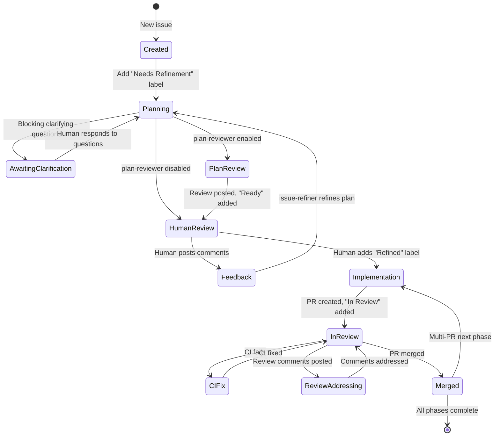

# Issue Lifecycle

The complete journey of an issue through Yeti, from the first flake of an idea to a merged pull request. This is the most important reference page -- understanding this flow is understanding how Yeti works.

---

## State Diagram



### Text Diagram

For environments where Mermaid is not available:

```
                          +-------------------+
                          |   Issue Created   |
                          +---------+---------+
                                    |
                          Add "Needs Refinement"
                                    |
                          +---------v---------+
                          |     Planning      |  <-- issue-refiner generates plan
                          +---------+---------+
                                    |
                    +---------------+---------------+
                    |                               |
            Blocking clarifying              Plan is actionable
              questions found                       |
                    |                               |
          +---------v---------+                     |
          | Awaiting Human    |                     |
          | Clarification     |                     |
          +---------+---------+                     |
                    |                               |
              Human responds                        |
              (triggers re-plan)                    |
                    |                               |
              (back to Planning)                    |
                                                    |
                    +---------------+---------------+
                    |                               |
            plan-reviewer               plan-reviewer
              enabled                     disabled
                    |                               |
          +---------v---------+                     |
          |   Plan Review     |                     |
          +---------+---------+                     |
                    |                               |
            Review posted,                          |
            "Ready" added                           |
                    |                               |
                    +---------------+---------------+
                                    |
                          +---------v---------+
                  +------>|   Human Review    |  <-- "Ready" label
                  |       +---------+---------+
                  |                 |
                  |       +---------+---------+
                  |       |                   |
                  |   Human posts         Human adds
                  |   feedback             "Refined"
                  |       |                   |
          +-------+-------+         +--------v--------+
          |   Feedback    |         |  Implementation  |  <-- issue-worker
          +---------------+         +--------+--------+
                                             |
                                    PR created,
                                    "In Review" added
                                             |
                                    +--------v--------+
                              +---->|    In Review     |<----+
                              |     +--------+--------+     |
                              |              |              |
                         CI fixed      +-----+-----+   Comments
                              |        |           |   addressed
                     +--------+--+  CI fails   Review    +--+--------+
                     |   CI Fix  |     |      comments   | Addressing |
                     +-----------+  +--v---+   posted  +-+-----------+
                                    |CI Fix|     |
                                    +------+  +--v-----------+
                                              | Addressing   |
                                              +--------------+
                                             |
                                        PR merged
                                             |
                                    +--------v--------+
                                    |     Merged      |
                                    +--------+--------+
                                             |
                                    +--------+--------+
                                    |                 |
                              Multi-PR          All phases
                              next phase         complete
                                    |                 |
                              (back to            Issue
                            Implementation)      closed
```

---

## Transitions in Detail

### 1. Issue Creation to Planning

**Trigger:** A human adds the `Needs Refinement` label to an issue.

**What happens:** The [issue-refiner](jobs/issue-refiner.md) picks up the issue on its next poll cycle. It creates an isolated git worktree, feeds the issue body and comments to Claude, and asks for a detailed implementation plan.

**Labels:** `Needs Refinement` is present at start.

**Comments posted:** An `## Implementation Plan` comment appears on the issue.

### 2. Planning (issue-refiner)

**Job:** [issue-refiner](jobs/issue-refiner.md)

The refiner reads the issue, any existing comments, and the repository's `yeti/OVERVIEW.md` documentation. Claude produces a plan covering which files to change, what the changes should be, risks, edge cases, and implementation order.

**Label transitions:**

- Removes `Needs Refinement`
- If the plan is **actionable** (no blocking clarifying questions): adds `Needs Plan Review` (if plan-reviewer is enabled) **or** `Ready` (if disabled)
- If the plan has **blocking clarifying questions**: no workflow label is added. The issue waits for the human to respond to the questions as a comment, which triggers a new refinement cycle.

For `[ci-unrelated]` issues with actionable plans, the refiner also auto-adds `Refined` to skip human approval entirely.

### 3. Plan Review (plan-reviewer, optional)

**Job:** [plan-reviewer](jobs/plan-reviewer.md)

When enabled, the plan-reviewer acts as an adversarial critic. It reads the plan and the issue, then posts a `## Plan Review` comment highlighting gaps, risks, edge cases, and over-engineering concerns.

**Default mode (`reviewLoop: false`):** The review is written for the **human**, not for automatic AI refinement. The intent is to give you a second opinion before you approve the plan.

**Review loop mode (`reviewLoop: true`):** The reviewer includes a verdict (APPROVED or NEEDS REVISION). If the plan needs revision and the round count is under `maxPlanRounds`, the issue is sent back to issue-refiner for automatic re-refinement. If max rounds are reached, the issue falls through to human review with a warning comment.

**Label transitions (default):**

- Removes `Needs Plan Review`
- Adds `Ready`

**Label transitions (review loop, needs revision, under max rounds):**

- Removes `Needs Plan Review`
- Adds `Needs Refinement` (triggers issue-refiner again)

### 4. Human Review (Ready state)

**Label:** `Ready`

The ball is in your court. The issue now has:

- An implementation plan (from issue-refiner)
- Optionally, a plan review (from plan-reviewer)

You have two choices:

- **Approve:** Add the `Refined` label to greenlight implementation.
- **Request changes:** Post a comment with feedback. The issue-refiner will pick up your comments on its next cycle and refine the plan.

### 5. Feedback Loop

**Job:** [issue-refiner](jobs/issue-refiner.md)

When you post comments after the plan, the issue-refiner detects unreacted human comments and enters refinement mode. It updates the existing plan comment in-place (rather than posting a new one) and reacts with a thumbsup to each feedback comment it has addressed.

**Label transitions:**

- Removes `Ready` (while processing feedback)
- Re-adds `Needs Plan Review` or `Ready` (after updated plan is posted)

This cycle continues until you are satisfied and add `Refined`.

### 6. Implementation (issue-worker)

**Job:** [issue-worker](jobs/issue-worker.md)

**Trigger:** `Refined` label on an issue.

The worker creates a worktree on branch `yeti/issue-<number>-<hex4>`, runs Claude with the plan, and opens a PR.

**PR titles:**

- Single PR: `fix: resolve #N -- <title>`
- Multi-PR phase: `fix(#N): <phase title> (M/total)`

**PR bodies:**

- Single PR: Description + `Closes #N`
- Intermediate phase: Description + `Part of #N`
- Final phase: Description + `Closes #N`

**Label transitions:**

- Removes `Refined`
- Removes `Ready`
- Adds `In Review` to the source issue

**Guards:**

- Checks for existing open PR for the issue (skips if found)
- Tree-diff guard: only pushes if there are both new commits and actual tree differences
- Fresh duplicate-PR guard: bypasses the PR list cache to avoid race conditions

### 7. CI Fixing (ci-fixer)

**Job:** [ci-fixer](jobs/ci-fixer.md)

Automatically watches all open Yeti PRs for:

- **Merge conflicts:** Merges the base branch and uses Claude to resolve conflicts
- **Cancelled checks:** Re-runs the GitHub Actions workflow
- **Unrelated failures:** Files a `[ci-unrelated]` issue, reverts previous fix attempts, merges the base branch
- **Related failures:** Uses Claude to analyze logs and fix the code

After fixing, the ci-fixer updates the PR description to reflect the changes.

### 8. Review Addressing (review-addresser)

**Job:** [review-addresser](jobs/review-addresser.md)

When review comments appear on a Yeti PR, the review-addresser picks them up. It runs Claude to make code changes or post text responses, pushes any changes, and reacts with a thumbsup to each addressed comment.

**Label transitions:**

- Adds `Ready` to the PR after addressing comments (signals that the PR needs another look)

### 9. Auto-merge (auto-merger)

**Job:** [auto-merger](jobs/auto-merger.md)

Watches for PRs that meet merge criteria and squash-merges them automatically. No AI is needed for this job.

**Label transitions:**

- Removes `In Review` from the source issue after merging a `yeti/issue-*` PR

### 10. Multi-PR Phases

For large issues where the plan specifies multiple PRs, Yeti handles them sequentially:

1. The issue-worker creates the first PR.
2. When that PR is merged, the issue-worker detects that more phases remain.
3. It re-adds the `Refined` label to the issue, triggering the next phase.
4. A progress comment is posted on the issue summarizing completed phases.
5. The cycle repeats until all phases are complete, at which point the final PR's body contains `Closes #N`.

---

## Special Cases

### [ci-unrelated] Issues

Issues with titles starting with `[ci-unrelated]` are created by the ci-fixer when it identifies CI failures unrelated to PR changes (flakey tests, runner issues, pre-existing failures).

These issues follow a shortened lifecycle:

1. The issue-refiner processes them **without** requiring the `Needs Refinement` label.
2. After posting the plan, the refiner auto-adds `Refined` (skipping human approval).
3. The issue-worker implements the fix as a normal PR.

### [yeti-error] Issues

Issues with titles matching `[yeti-error] <fingerprint>` are Yeti's own error reports. They require triage before planning:

1. The [triage-yeti-errors](jobs/triage-yeti-errors.md) job investigates the error and posts a `## Yeti Error Investigation Report`.
2. Only after the report is posted will the issue-refiner consider the issue for planning.
3. The issue-refiner then requires the `Needs Refinement` label (same as regular issues).

### Webhook-Accelerated Triggers

When GitHub webhooks are configured, certain transitions happen faster than the default polling intervals:

- **PR approval** --- A `pull_request_review` webhook with an `approved` state triggers the [auto-merger](jobs/auto-merger.md) immediately for eligible PRs (`yeti/issue-*`, `yeti/improve-*`, and Dependabot PRs).
- **PR closed** --- A `pull_request.closed` webhook removes the item from the dashboard queue cache immediately, keeping the queue view accurate without waiting for the next scan.
- **Issue labeled/unlabeled** --- `issues.labeled` and `issues.unlabeled` webhooks trigger the relevant job and update the queue cache in real time.
- **CI failure** --- A `check_run.completed` webhook (for failures on PRs) triggers the ci-fixer immediately.

Webhooks supplement polling --- they never replace it. If webhooks are not configured or a webhook delivery is missed, the normal polling intervals pick up the work on the next cycle.

### Dependabot PRs

Dependabot PRs are auto-merged by the [auto-merger](jobs/auto-merger.md) when all checks pass. No issue or plan is needed.

### Doc PRs (yeti/docs-*)

Documentation PRs created by the [doc-maintainer](jobs/doc-maintainer.md) are auto-merged when:

- All changed files are under `yeti/` or end in `.md`
- Checks pass **or** no checks are configured
